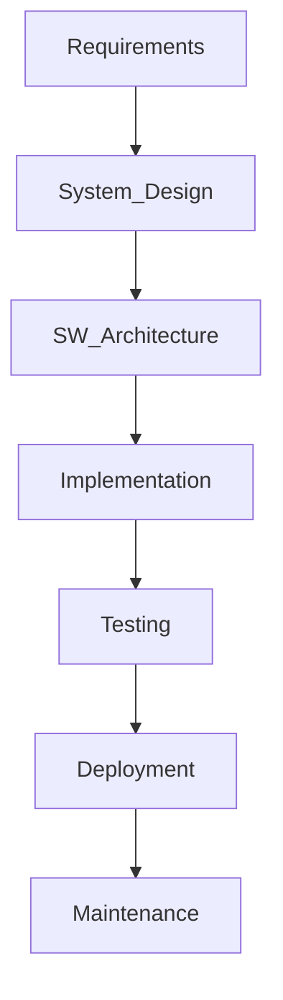

  
  

<h1 align="center">🚀 Software System Designer</h1>

  <b>Innovative | Analytical | Adaptive | Quality-driven</b>

---

## 👋 About Me

Hello! I'm a passionate <b>Software System Designer</b> with expertise in automotive and embedded domains. My journey revolves around architecting robust systems, driving quality through ASPICE-compliant processes, and building intelligent solutions with modern programming languages and machine learning.

---

## 🛠️ Core Skills

<table align="center">
  <tr>
    <td align="center"><b>Requirement Engineering</b></td>
    <td align="center"><b>System Designing</b></td>
    <td align="center"><b>ASPICE</b></td>
    <td align="center"><b>ASW / BSW</b></td>
    <td align="center"><b>C / C++</b></td>
    <td align="center"><b>Python</b></td>
    <td align="center"><b>Java</b></td>
    <td align="center"><b>Machine Learning</b></td>
  </tr>
  <tr>
    <td></td>
    <td></td>
    <td></td>
    <td></td>
    <td></td>
    <td></td>
    <td></td>
    <td></td>
  </tr>
</table>

---

## 🌟 Highlights

- 🔹 **System Architecture:** Designed scalable and robust architectures for automotive and embedded systems.
- 🔹 **ASPICE Implementation:** Ensured process compliance and quality assurance using ASPICE standards.
- 🔹 **Software Development:** Proficient in C, C++, Python, Java for real-time and AI-powered solutions.
- 🔹 **Machine Learning:** Developed and deployed ML models for intelligent system behavior.
- 🔹 **End-to-End Delivery:** From requirements to deployment, delivering high-quality, maintainable solutions.

---

## 📈 My Workflow

---

## 🚗 Domains & Platforms

- **Automotive Software (ASW/BSW)**
- **Embedded Systems**
- **AI/ML Applications**

---

## 📫 Get in Touch

- [LinkedIn](https://linkedin.com/in/your-profile)
- [Email](mailto:your.email@example.com)
- [GitHub](https://github.com/ishusagar-gss8kor)

---

  

