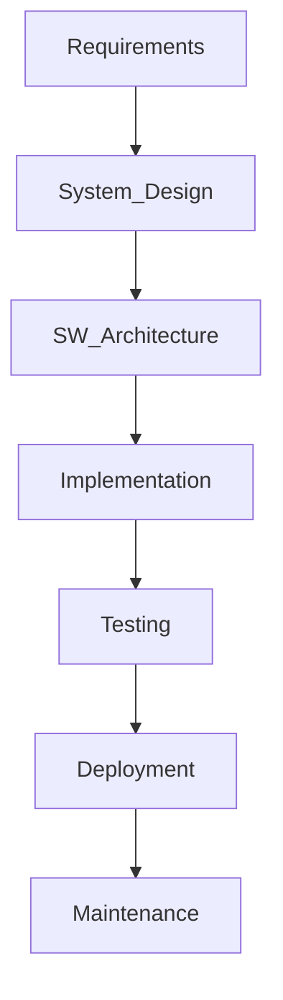

  

<h1 align="center">
  
</h1>

  

  
  

<h1 align="center">🚀 Software System Designer</h1>

  <b>Innovative | Analytical | Adaptive | Quality-driven</b>

---

##  About Me

Hey there! I'm **Ishu Sagar**, a passionate <b>Software System Designer</b> with a love for creating robust, future-ready solutions for Automotive, Embedded, and AI systems.  
I thrive at the intersection of technology, quality, and creativity.

---

## 🚀 Skills & Tools

  
  
  
  
  
  
  
  

---

## 🌟 Highlights

- ✨ **System Architecture:** Robust, scalable automotive and embedded systems.
- 🏆 **ASPICE Implementation:** Quality-driven processes and compliance.
- 💻 **Software Development:** C, C++, Python, Java for real-time and AI-powered solutions.
- 🤖 **Machine Learning:** ML models for intelligent system behavior.
- 🚀 **End-to-End Delivery:** From requirements to deployment.

---

## 🔄 My Workflow

---

## 🎨 Featured Project

  

> *Check out my [GitHub Projects](https://github.com/ishusagar-gss8kor?tab=repositories) for more!*

---

## 📈 GitHub Stats

  
  
  

---

## 🌐 Connect with Me

  
  
  

---

  

