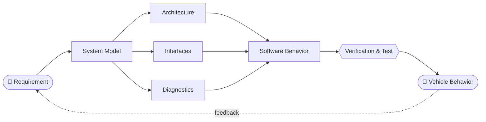
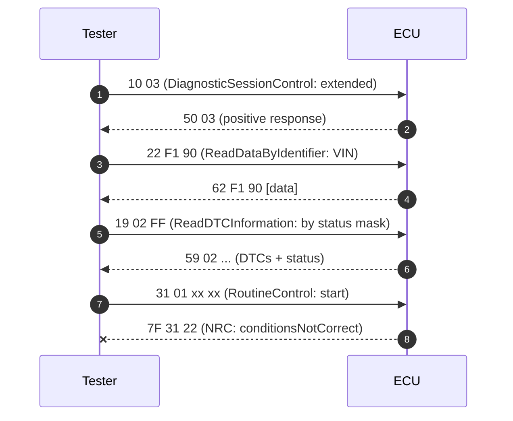

<!--
  Ishu Sagar — GitHub Profile README (v2)
  Setup: create a PUBLIC repo named exactly "ishusagar-gss8kor" and put this file in it as README.md
-->

<!-- ============ HERO ============ -->
<p align="center">
  
</p>

<p align="center">
  <a href="https://github.com/ishusagar-gss8kor">
    
  </a>
</p>

<p align="center">
  <a href="https://linkedin.com/in/ishusagar"></a>
  <a href="https://github.com/ishusagar-gss8kor?tab=repositories"></a>
  
</p>

---

## 🔌 Boot Log

```text
$ whoami
ishu_sagar — senior automotive systems engineer

$ cat focus.cfg
domain        = diagnostics + OBD regulatory requirements
languages     = C, C++, Python
mindset       = system intent first, implementation second
side_quest    = AI for engineering workflows & knowledge management

$ status
[ OK ] requirements understood
[ OK ] interfaces defined
[ OK ] diagnostics behaving
[ .. ] still learning, always
```

---

## 🧭 What I Do

I work where **standards, system behavior, embedded software and real vehicle constraints** collide, and I like being the person who connects those layers.

<table>
<tr>
<td width="50%" valign="top">

### 🏗️ Systems Engineering
- Requirement engineering & decomposition
- System architecture & interface definition
- Traceability & change management
- ASPICE-oriented development
- System-level problem analysis

</td>
<td width="50%" valign="top">

### 🩺 Diagnostics & OBD
- UDS (ISO 14229) · DoCAN (ISO 15765) · DoIP (ISO 13400)
- OBD / OBDonUDS · SAE J1979 / J2012
- DTC / DFC analysis
- Diagnostic communication design
- OBD monitoring concepts & regulatory requirements

</td>
</tr>
<tr>
<td valign="top">

### 💾 Embedded Software
- C / C++ / Python
- ECU software architecture, ASW / BSW interfaces
- Vehicle communication
- Debugging & root-cause analysis

</td>
<td valign="top">

### ⚙️ Tooling & Automation
- INCA · A2L / HEX / DCM
- Python automation for engineering workflows
- Diagnostic data analysis
- Git / GitHub, requirements & configuration tools

</td>
</tr>
</table>

---

## 🧠 How I Think: From Requirement to Vehicle


```mermaid
flowchart LR
    R([📄 Requirement]) --> S[System Model]
    S --> A[Architecture]
    S --> I[Interfaces]
    S --> D[Diagnostics]
    A --> SW[Software Behavior]
    I --> SW
    D --> SW
    SW --> V{{Verification & Test}}
    V --> VB([🚗 Vehicle Behavior])
    VB -. feedback .-> R
```

> **The goal is not just to make software work. The goal is to make the system behave correctly.**

---

## 📡 A Day in the Life: One Diagnostic Exchange


```mermaid
sequenceDiagram
    autonumber
    participant T as Tester
    participant E as ECU
    T->>E: 10 03 (DiagnosticSessionControl: extended)
    E-->>T: 50 03 (positive response)
    T->>E: 22 F1 90 (ReadDataByIdentifier: VIN)
    E-->>T: 62 F1 90 [data]
    T->>E: 19 02 FF (ReadDTCInformation: by status mask)
    E-->>T: 59 02 ... (DTCs + status)
    T->>E: 31 01 xx xx (RoutineControl: start)
    E--xT: 7F 31 22 (NRC: conditionsNotCorrect)
```

<details>
<summary><b>🔎 Cheat sheet: how I read a UDS frame</b></summary>

<br/>

| Byte | Meaning |
|------|---------|
| `SID` | Service request, e.g. `0x22` ReadDataByIdentifier |
| `SID + 0x40` | Positive response, e.g. `0x62` |
| `0x7F SID NRC` | Negative response with its reason code |
| `0x10` / `0x11` / `0x14` / `0x19` | Session control / ECU reset / Clear DTC / Read DTC |
| `0x27` / `0x2E` / `0x31` / `0x3E` | Security access / Write DID / Routine control / Tester present |

The real work starts after the byte level: *why* did this NRC occur, which requirement defines the condition, and which software path produced it?

</details>

---

## 🛠️ Tech Stack

<p align="center">
  
  
  
  
  
</p>
<p align="center">
  
  
  
  
  
  
</p>

---

## 🚀 What I Build

| | Focus | Outcome |
|---|---|---|
| 🩺 | **Diagnostics & OBD** | Clear DTC behavior, diagnostic communication and regulatory-driven requirements |
| 🏗️ | **System Engineering** | Complex requirements broken into behavior, interfaces, software responsibilities and verification criteria |
| 🤖 | **Engineering Automation** | Small Python tools that remove repetitive work and make analysis faster and more consistent |
| 🔍 | **Root-Cause Analysis** | Tracing a vehicle symptom back through ECU behavior to the requirement behind it |

<!--
  FEATURED PROJECTS: uncomment and replace YOUR_REPO to show pinned cards
  <p align="center">
    <a href="https://github.com/ishusagar-gss8kor/YOUR_REPO"></a>
    <a href="https://github.com/ishusagar-gss8kor/YOUR_REPO_2"></a>
  </p>
-->

---

## 🔭 Currently Exploring

- 🧩 Diagnostic architectures and OBDonUDS requirement traceability
- 🤖 Applying AI to engineering workflows and technical knowledge management
- 🐍 Python tooling for diagnostic data analysis

---

## 📊 GitHub Activity

<p align="center">
  
  
</p>
<p align="center">
  
</p>

---

## 🤝 Let's Connect

I'm happy to talk diagnostics, OBD, system architecture or engineering automation.

<p align="center">
  <a href="https://linkedin.com/in/ishusagar"></a>
  <a href="https://github.com/ishusagar-gss8kor"></a>
</p>

<p align="center">
  
</p>

<p align="center"><i>Systems thinking · Engineering discipline · Continuous learning</i></p>
